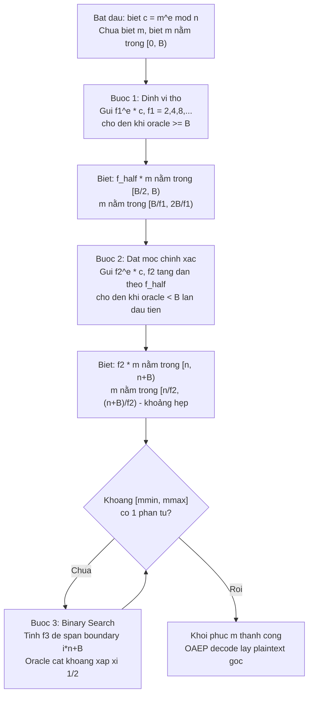

> **Prerequisites**: RSA cryptosystem (modular exponentiation, public/private key), OAEP padding scheme (PKCS#1 v2.0), khái niệm Chosen Ciphertext Attack (CCA), padding oracle
> **Lesson type**: Attack / Cryptanalysis
>
> **Notation** (ký hiệu dùng mà không định nghĩa trong bài này):
> | Ký hiệu | Ý nghĩa |
> |---------|---------|
> | $n$ | RSA modulus ($n = pq$) |
> | $e, d$ | Public và private RSA exponent |
> | $k$ | Byte-length của modulus: $k = \lceil \log_{256} n \rceil$ |
> | $B$ | Ngưỡng quan trọng: $B = 2^{8(k-1)}$ |
> | $c$ | Target ciphertext cần giải mã |
> | $m$ | Plaintext mục tiêu: $c \equiv m^e \pmod{n}$ |
> | $\mathcal{O}$ | Padding oracle — black-box trả về 1 bit thông tin |
> | $\lfloor x \rfloor$, $\lceil x \rceil$ | Floor và ceiling của $x$ |

---

## Bối cảnh và Điều kiện Tấn công

### Câu chuyện bắt đầu: OAEP ra đời để làm gì?

Năm 1998, Daniel Bleichenbacher công bố một cuộc tấn công tàn khốc vào RSA PKCS#1 v1.5 — kẻ tấn công có thể giải mã bất kỳ ciphertext nào chỉ với khoảng một triệu truy vấn oracle. Cộng đồng mật mã nhanh chóng phản ứng bằng cách chuẩn hóa **RSAES-OAEP** (RSA Optimal Asymmetric Encryption Padding) trong PKCS#1 v2.0.

Điều đặc biệt là OAEP không chỉ là một bản vá vội vàng — nó đi kèm với **bằng chứng bảo mật toán học chặt chẽ**: Shoup (2001) chứng minh rằng RSAES-OAEP là IND-CCA2 secure trong Random Oracle Model. Tài liệu PKCS#1 v2.0 thậm chí tuyên bố thẳng thắn rằng *"a chosen ciphertext attack is ineffective against a plaintext-aware encryption scheme such as RSAES-OAEP."*

Năm 2001, James Manger làm cộng đồng choáng váng: ông công bố một cuộc tấn công chosen-ciphertext có thể giải mã ciphertext OAEP chỉ với **khoảng $\log_2 n$ truy vấn** — tức chỉ khoảng 1000–2000 truy vấn cho RSA-2048. Không phải bằng cách phá vỡ bằng chứng bảo mật của OAEP, mà bằng cách khai thác một **side channel trong quá trình implementation**.

### Điều kiện để tấn công

Manger's attack là một **adaptive chosen-ciphertext attack** và yêu cầu hai điều kiện:

**Điều kiện 1 — Oracle trả về 1 bit thông tin.** Kẻ tấn công cần có khả năng gửi một ciphertext tùy ý đến một hệ thống giải mã và nhận lại thông tin liệu $m' = c'^d \bmod n$ có thỏa mãn $m' < B$ hay không. Thông tin này rò rỉ qua:
- **Thông báo lỗi phân biệt**: PKCS#1 v2.0 có hai loại lỗi giải mã — lỗi integer-to-octet conversion (xảy ra sớm, khi byte đầu tiên $\neq 0$) và lỗi OAEP integrity check (xảy ra sau). Nếu implementation trả về hai mã lỗi khác nhau, oracle lộ.
- **Timing side channel**: Lỗi ở bước đầu thường kết thúc nhanh hơn; lỗi ở OAEP decode chậm hơn. Đo thời gian phản hồi là đủ.

**Điều kiện 2 — Hệ thống chấp nhận decrypt nhiều ciphertext.** Server phải sẵn sàng giải mã hàng nghìn ciphertext không hỏi han (ví dụ TLS server tự động xử lý handshake).

> [!warning] Tại sao đây không phải "phá vỡ bằng chứng bảo mật OAEP"?
> Bằng chứng IND-CCA2 của OAEP giả định rằng decryption oracle **chỉ trả về "thành công" hay "thất bại"** như một bit duy nhất — không phân biệt *loại* thất bại. Manger's attack không mâu thuẫn với bằng chứng đó; nó khai thác các implementation **vi phạm giả thiết này** khi vô tình leak thêm thông tin.

---

## Ý tưởng Cốt lõi

### Viên gạch 1: Ý nghĩa của B và MSB

Sau RSA decryption, ta có một số nguyên $m' \in [0, n)$. Khi chuyển sang byte string độ dài $k$ bytes (integer-to-octet string conversion), **byte đầu tiên (most significant byte) phải là `0x00`** — đây là yêu cầu của OAEP. Điều này tương đương với:

$$m' < 2^{8(k-1)} = B$$

Nếu $m' \geq B$, byte đầu tiên khác `0x00`, và decoding thất bại ngay lập tức. Đây chính là nguồn gốc oracle: một implementation bất cẩn sẽ dừng sớm khi $m' \geq B$, tạo ra timing khác biệt.

Vậy, oracle $\mathcal{O}(c)$ trả về:

$$\mathcal{O}(c) = \begin{cases} 0 & \text{nếu } c^d \bmod n < B \quad (\text{MSB} = \texttt{0x00}) \\ 1 & \text{nếu } c^d \bmod n \geq B \quad (\text{MSB} \neq \texttt{0x00}) \end{cases}$$

### Viên gạch 2: RSA Malleability — Vũ khí tấn công

RSA là **malleable**: cho ciphertext $c = m^e \bmod n$ và một nhân tử $f$ bất kỳ, kẻ tấn công có thể tạo ciphertext mới:

$$c' = f^e \cdot c \bmod n$$

Khi server giải mã $c'$:

$$c'^d \equiv (f^e \cdot c)^d \equiv f \cdot m \pmod{n}$$

Nghĩa là: **nhân ciphertext với $f^e$** tương đương với **nhân plaintext với $f$** — mà không cần biết $m$ hay $d$. Đây là đòn bẩy cho phép Manger liên tục "dịch chuyển" plaintext trong không gian $[0, n)$ và hỏi oracle xem nó có vượt ngưỡng $B$ không.

> [!tip] Trực giác hình học
> Hãy hình dung $m$ là một điểm ẩn trên đoạn $[0, n)$. Oracle cho biết điểm đó nằm bên trái hay bên phải ngưỡng $B$. Nhân ciphertext với $f^e$ tương đương kéo giãn và dịch chuyển điểm đó trên đoạn số. Ba bước tấn công dùng thao tác này để dần dần ép điểm ẩn vào một khoảng ngày càng hẹp — như tìm kiếm nhị phân nhưng trên vòng modular.

---

## Tấn công Manger — Ba Bước

Ta có: target ciphertext $c = m^e \bmod n$, chưa biết $m$. Biết $B = 2^{8(k-1)}$. Giả sử $2B < n$ (thỏa mãn với RSA modulus là bội số chẵn của 8 bit). Mục tiêu: khôi phục $m$.

### Bức tranh tổng thể: Tại sao cần đúng ba bước?

Trước khi đi vào chi tiết, hãy hiểu mục đích của từng bước trong chuỗi thu hẹp khoảng:

**Bước 1** ("Định vị thô") xuất phát từ $m \in [0, B)$ — quá rộng để binary search. Dùng $O(\log(n/B))$ queries để tìm $f_{1/2}$ sao cho $f_{1/2} \cdot m \in [B/2, B)$. Lúc này khoảng chứa $m$ có độ rộng $B/f_1$. Quan trọng hơn, ta thu được **hệ số $f_{1/2}$ đã biết** — đây là điều kiện tiên quyết để Bước 2 hoạt động.

**Bước 2** ("Đặt mốc chính xác") dùng $f_{1/2}$ để xây dựng chuỗi nhân tử $f_{2,j}$. Mục tiêu: tìm $f_2$ sao cho $f_2 \cdot m$ vượt qua $n$ đúng một lần, rơi vào $[n, n+B)$. Kết quả: khoảng chứa $m$ thu hẹp đột ngột xuống độ rộng $B/f_2 \approx m \cdot B/n \ll B/f_1$ — nhỏ hơn nhiều lần so với sau Bước 1. Đây là điểm xuất phát sạch cho binary search.

**Bước 3** ("Binary search") từ khoảng hẹp đó, mỗi query cắt khoảng xấp xỉ một nửa trong $O(\log n)$ bước cho đến khi còn một giá trị duy nhất.

Lý do không thể bỏ Bước 2 và nhảy thẳng từ Bước 1 sang Bước 3: sau Bước 1, khoảng vẫn còn rộng $\sim B/2$ phần tử. Bước 2 thu hẹp xuống $\approx m \cdot B/n$ phần tử chỉ trong $O(n/B)$ queries — hiệu quả hơn nhiều so với dùng binary search ngay.

---

### Bước 1: Định vị thô — Đưa $f_1 \cdot m$ vào $[B, 2B)$

Ta thử lần lượt $f_1 = 2, 4, 8, \ldots, 2^i, \ldots$ bằng cách gửi $c_i = f_1^e \cdot c \bmod n$ đến oracle, cho đến khi oracle trả về $f_1 \cdot m \geq B$.

**Tại sao dừng được?** Vì $m < B$, và ta nhân đôi liên tục, nên sau hữu hạn bước tất nhiên $f_1 \cdot m$ sẽ vượt $B$.

**Điều kiện dừng** ($f_1 \cdot m \geq B$) cho ta biết gì? Khi oracle báo $\geq B$ lần đầu tiên tại $f_1 = 2^i$, ta biết:

$$f_1 \cdot m \geq B \quad \text{và} \quad \frac{f_1}{2} \cdot m < B$$

Kết hợp: $f_{1/2} \cdot m \in [B/2, B)$ với $f_{1/2} = f_1/2$, tức là:

$$m \in \left[\frac{B}{f_1}, \frac{2B}{f_1}\right)$$

**Tại sao Bước 1 đảm bảo không có wrap modulo $n$?** Vì $m < B$ và ta dừng ngay khi $f_1 \cdot m \geq B$ lần đầu, nên $f_1/2 \cdot m < B$ tức $f_1 \cdot m < 2B < 2n$. Như vậy $f_1 \cdot m$ chưa bao giờ vượt qua $n$ — oracle nhìn thấy đúng $f_1 \cdot m$, không phải $f_1 \cdot m \bmod n$.

Bước 1 tốn $O(\log_2(n/B))$ truy vấn — khoảng 7–8 truy vấn với RSA-2048.

---

### Bước 2: Đặt mốc chính xác — Đưa $f_2 \cdot m$ vào $[n, n+B)$

Đặt $f_{1/2} = f_1/2$ (kết quả từ Bước 1, đã biết $f_{1/2} \cdot m \in [B/2, B)$). Ta xây dựng:

$$f_{2,j} = \left(\left\lfloor\frac{n+B}{B}\right\rfloor + j\right) \cdot f_{1/2}, \quad j = 0, 1, 2, \ldots$$

Gửi $c_j = f_{2,j}^e \cdot c \bmod n$ đến oracle cho đến khi oracle trả về $f_{2,j} \cdot m < B$.

**Tại sao công thức $f_{2,j}$ được thiết kế như vậy?** Ta muốn $f_{2,j} \cdot m \geq n$ ngay từ đầu, tức là $f_{2,j} \geq n/m$. Vì $f_{1/2} \cdot m \in [B/2, B)$ nên $m \leq B$, và:

$$f_{2,0} = \left\lfloor\frac{n+B}{B}\right\rfloor \cdot f_{1/2} \geq \frac{n+B}{B} \cdot \frac{B}{2 \cdot m} \cdot m = \frac{n+B}{2}$$

Điều này không đảm bảo $f_{2,0} \cdot m \geq n$ ngay, nhưng bước tăng mỗi lần là $f_{1/2} \cdot m < B$ — rất nhỏ. Ta tăng dần cho đến khi $f_{2,j} \cdot m$ vượt qua $n$.

**Tại sao oracle trả về $< B$ lần đầu tiên có nghĩa là "wrap đúng một lần"?** Ban đầu $f_{2,j} \cdot m \geq B$ (oracle: $\geq B$, chưa có wrap). Khi oracle lần đầu trả về $< B$, điều duy nhất có thể xảy ra là $f_{2,j} \cdot m$ vừa vượt qua $n$ và $f_{2,j} \cdot m \bmod n < B$. Vì mỗi bước tăng $< B$ nên $f_{2,j} \cdot m$ không thể nhảy qua cả khoảng $[n, n+B)$. Nghĩa là:

$$f_{2,j} \cdot m \in [n,\; n+B)$$

Suy ra:

$$m \in \left[\frac{n}{f_2},\; \frac{n+B}{f_2}\right)$$

Độ rộng khoảng này là $B/f_2$. Vì $f_2 \approx n/m$, nên $B/f_2 \approx m \cdot B/n$. Với $m < B$ và $n \approx 256B$ (RSA-2048): độ rộng $\approx B/256$ — hẹp hơn sau Bước 1 tám lần.

Bước 2 tốn $O(n/B)$ truy vấn — khoảng vài trăm.

---

### Bước 3: Binary Search — Thu hẹp về một điểm duy nhất

Từ Bước 2, ta có khoảng $[m_{\min}, m_{\max}]$ chứa $m$. Lặp lại cho đến khi $m_{\min} = m_{\max}$:

**3.1. Chọn hệ số scale $f_{\text{tmp}}$:**

$$f_{\text{tmp}} = \left\lfloor\frac{2B}{m_{\max} - m_{\min}}\right\rfloor$$

Mục đích: scale khoảng $[m_{\min}, m_{\max}]$ lên để độ rộng scaled $\approx 2B$. Đây là bước trung gian để định vị chỉ số $i$ ở bước 3.2 — $f_{\text{tmp}}$ không được dùng trực tiếp để hỏi oracle. Lý do cần độ rộng $\geq B$ sẽ rõ sau khi hiểu vai trò của $f_3$ ở bước 3.3.

**3.2. Tìm chỉ số $i$:**

$$i = \left\lfloor\frac{f_{\text{tmp}} \cdot m_{\min}}{n}\right\rfloor$$

Đây là số lần $f_{\text{tmp}} \cdot m_{\min}$ "chứa đủ" $n$ — tức là $f_{\text{tmp}} \cdot m_{\min} \in [i \cdot n, (i+1) \cdot n)$. Boundary gần nhất phía trên là $i \cdot n + B$.

**3.3. Tính $f_3$ — hệ số thật để truy vấn oracle:**

$$f_3 = \left\lceil\frac{i \cdot n}{m_{\min}}\right\rceil$$

Đây là bước quan trọng nhất. Để hiểu tại sao khoảng $[f_3 \cdot m_{\min}, f_3 \cdot m_{\max}]$ **chắc chắn span qua boundary $i \cdot n + B$**, cần thấy rõ hai điều sau đây đồng thời đúng:

**Điều 1 — Lower end luôn nằm trong $[in, in+B)$, không bao giờ vượt qua boundary từ trước.**

Từ phép ceiling: $f_3 \geq i \cdot n / m_{\min}$ nên $f_3 \cdot m_{\min} \geq i \cdot n$.  
Từ trên: $f_3 \leq i \cdot n / m_{\min} + 1$ nên $f_3 \cdot m_{\min} \leq i \cdot n + m_{\min}$.  
Vì $m_{\min} \leq m < B$, suy ra $f_3 \cdot m_{\min} < i \cdot n + B$.

Tóm lại: $f_3 \cdot m_{\min} \in [i \cdot n,\; i \cdot n + B)$.

> [!tip] Vai trò thật sự của $f_{\text{tmp}}$ và $f_3$
> $f_{\text{tmp}}$ không được dùng trực tiếp để truy vấn oracle. Nó chỉ là một bước tính trung gian để định vị chỉ số $i$. $f_3$ mới là hệ số thật — được điều chỉnh từ $f_{\text{tmp}}$ để ghim lower end vào $[in, in+B)$. Hai hệ số xấp xỉ nhau ($f_3 \approx f_{\text{tmp}}$) nên width vẫn được bảo toàn $\geq B$.

**3.4. Truy vấn oracle và cập nhật khoảng:**

Gửi $f_3^e \cdot c \bmod n$ đến oracle. Vì ta biết $f_3 \cdot m \in [i \cdot n, (i+1) \cdot n)$, oracle hỏi thực chất là: $f_3 \cdot m \geq i \cdot n + B$? Hai khả năng:

- Oracle trả về $\geq B$: $f_3 \cdot m \geq i \cdot n + B$, suy ra:

$$m_{\min} \leftarrow \left\lceil\frac{i \cdot n + B}{f_3}\right\rceil$$

- Oracle trả về $< B$: $f_3 \cdot m < i \cdot n + B$, suy ra:

$$m_{\max} \leftarrow \left\lfloor\frac{i \cdot n + B - 1}{f_3}\right\rfloor$$

Mỗi lần lặp, khoảng $[m_{\min}, m_{\max}]$ bị thu hẹp xấp xỉ một nửa — đây là **binary search** trên không gian plaintext. Bước 3 tốn $O(\log_2 n)$ truy vấn.

---

## Ví dụ Số — End-to-End với $n = 1000$, $B = 100$, $m = 35$

> [!example] Ví dụ đầy đủ: $n = 1000$, $B = 100$, $m = 35$
> Ta cần khôi phục $m = 35$ từ $c = 35^e \bmod 1000$ mà không biết $m$ hay $d$.
> Điều kiện $2B < n$ thỏa mãn: $200 < 1000$. Lưu ý $m = 35 < B = 100$ đúng như yêu cầu OAEP.
>
> **Bước 1 — Định vị thô:**
>
> Thử $f_1 = 2$: $f_1 \cdot m = 70 < 100 = B$. Oracle: $< B$. Tiếp.
> Thử $f_1 = 4$: $f_1 \cdot m = 140 \geq 100 = B$. Oracle: $\geq B$. Dừng.
>
> Kết quả: $f_1 = 4$, $f_{1/2} = 2$.
> $f_{1/2} \cdot m = 70 \in [50, 100)$ ✓ — không có wrap modulo $n$ vì $140 < 2 \times 1000$.
> Biết: $m \in [\lceil 100/4 \rceil, \lfloor 200/4 \rfloor) = [25, 49]$.
>
> **Bước 2 — Đặt mốc chính xác:**
>
> $\lfloor (1000 + 100) / 100 \rfloor = 11$, nên $f_{2,j} = (11 + j) \cdot 2$.
>
> | $j$ | $f_{2,j}$ | $f_{2,j} \cdot m$ | $f_{2,j} \cdot m \bmod 1000$ | Oracle |
> |-----|-----------|------------------|------------------------------|--------|
> | 0 | 22 | 770 | 770 | $\geq B$ |
> | 1 | 24 | 840 | 840 | $\geq B$ |
> | 2 | 26 | 910 | 910 | $\geq B$ |
> | 3 | 28 | 980 | 980 | $\geq B$ |
> | 4 | 30 | **1050** | **50** | **$< B$** ✓ |
>
> Dừng tại $j=4$, $f_2 = 30$: $30 \times 35 = 1050 \in [1000, 1100)$ — wrap đúng một lần ✓
> Biết: $m \in [\lceil 1000/30 \rceil, \lfloor 1100/30 \rfloor] = [34, 36]$.
>
> **Bước 3 — Binary Search:**
>
> *Lần lặp 1:* $m_{\min} = 34$, $m_{\max} = 36$, độ rộng $= 2$.
>
> $f_{\text{tmp}} = \lfloor 2 \times 100 / 2 \rfloor = 100$
> $i = \lfloor 100 \times 34 / 1000 \rfloor = \lfloor 3400/1000 \rfloor = 3$
> $f_3 = \lceil 3 \times 1000 / 34 \rceil = \lceil 88.24 \rceil = 89$
>
> Kiểm tra span: $f_3 \cdot m_{\min} = 89 \times 34 = 3026$, $f_3 \cdot m_{\max} = 89 \times 36 = 3204$.
> Boundary: $3 \times 1000 + 100 = 3100$ nằm trong $[3026, 3204]$ ✓
>
> Oracle nhận $89^e \cdot c \bmod 1000$: thực ra $89 \times 35 = 3115$, $3115 \bmod 1000 = 115 \geq 100$. Trả về $\geq B$.
> Cập nhật: $m_{\min} \leftarrow \lceil 3100/89 \rceil = \lceil 34.83 \rceil = 35$.
> Khoảng mới: $[35, 36]$.
>
> *Lần lặp 2:* $m_{\min} = 35$, $m_{\max} = 36$, độ rộng $= 1$.
>
> $f_{\text{tmp}} = \lfloor 2 \times 100 / 1 \rfloor = 200$
> $i = \lfloor 200 \times 35 / 1000 \rfloor = \lfloor 7000/1000 \rfloor = 7$
> $f_3 = \lceil 7 \times 1000 / 35 \rceil = \lceil 200 \rceil = 200$
>
> Kiểm tra span: $f_3 \cdot m_{\min} = 200 \times 35 = 7000$, $f_3 \cdot m_{\max} = 200 \times 36 = 7200$.
> Boundary: $7 \times 1000 + 100 = 7100$ nằm trong $[7000, 7200]$ ✓
>
> Oracle: $200 \times 35 = 7000$, $7000 \bmod 1000 = 0 < 100$. Trả về $< B$.
> Cập nhật: $m_{\max} \leftarrow \lfloor 7099/200 \rfloor = \lfloor 35.495 \rfloor = 35$.
> Khoảng mới: $[35, 35]$ — **hoàn tất!**
>
> **Kết quả**: $m = 35$. Tổng cộng: 2 (Bước 1) + 5 (Bước 2) + 2 (Bước 3) = **9 oracle queries**.

---

## Sơ đồ Tổng quan Luồng Tấn công

---

## Phân tích Độ phức tạp

> [!abstract] Theorem — Số lượng Oracle Queries
> Manger's attack phục hồi $m$ với tổng số oracle queries khoảng $\log_2(n/B) + n/B + \log_2 n$. Với RSA-2048 ($k=256$, $n/B \approx 256$):
>
> - Bước 1: $\approx \log_2(256) = 8$ queries
> - Bước 2: $\leq n/B \approx 256$ queries
> - Bước 3: $\approx \log_2 n \approx 2048$ queries
> - **Tổng: khoảng 2300 queries**

**Proof sketch.** Bước 1 lặp $\log_2(n/m) \leq \log_2 n$ lần vì $m \geq 1$ và $f_1$ tăng theo cấp số nhân. Bước 2 lặp tối đa $\lceil n/B \rceil$ lần vì mỗi bước $f_{2,j} \cdot m$ tăng thêm $f_{1/2} \cdot m < B$, nên cần tối đa $\lceil n/B \rceil$ bước để vượt qua $n$. Bước 3 thu hẹp khoảng $\approx 1/2$ mỗi truy vấn nên cần $O(\log_2(B/f_2)) = O(\log n)$ lần. $\blacksquare$

So sánh với Bleichenbacher's attack trên PKCS#1 v1.5 (cần $\approx 10^6$ queries), Manger's attack **nhanh hơn hàng trăm nghìn lần** — một order-of-magnitude khác biệt.

---

## Tại sao Bằng chứng Bảo mật OAEP Không Bảo vệ Được?

> [!abstract] Định lý bảo mật OAEP (Fujisaki et al. 2001, Shoup 2001)
> RSAES-OAEP là IND-CCA2 secure trong Random Oracle Model, với điều kiện RSA là one-way function.

**Proof sketch và điểm mấu chốt.** Trong bằng chứng, adversary có quyền truy vấn decryption oracle $O_d$ nhận ciphertext và trả về plaintext (hoặc $\perp$ nếu invalid). Bằng chứng cho thấy nếu adversary phân biệt được hai plaintext, nó giải được RSA one-way problem.

Tuy nhiên, bằng chứng giả định oracle $O_d$ **chỉ trả về một trong hai kết quả**: plaintext hoặc $\perp$ — không cho phép oracle trả về thông tin về *loại lỗi* hay *thời điểm lỗi xảy ra*.

Manger's attack không xây dựng oracle từ $O_d$ tiêu chuẩn — nó xây dựng oracle từ **side channel** ($\mathcal{O}$ phân biệt hai loại failure). Đây là lý do:

> [!danger] Khoảng cách Nguy hiểm giữa Proof và Implementation
> Bằng chứng bảo mật tồn tại trong **model toán học** nơi oracle là một black-box hoàn hảo. Implementation thực tế hoạt động trên **phần cứng vật lý** với timing, error messages, và cache behavior. Khoảng cách này — gọi là *the gap between the model and reality* — chính là nơi Manger's attack sống.
>
> Đây là bài học cơ bản: **Cryptographic security proof ≠ implementation security**. Một scheme có thể provably secure về mặt lý thuyết nhưng vẫn bị phá vỡ trong thực tế nếu implementation leak thêm thông tin ngoài model.

---

## Biện pháp Phòng thủ

> [!abstract] Theorem — Điều kiện để OAEP An toàn trong Thực tế
> RSAES-OAEP implementation kháng Manger's attack nếu và chỉ nếu: (1) tất cả decryption failures trả về cùng một error response không phân biệt loại lỗi, và (2) thời gian thực thi của toàn bộ decryption (kể cả khi lỗi) là **constant-time** — không phụ thuộc vào giá trị của plaintext hay loại lỗi.

**Proof sketch.** Nếu cả hai điều kiện thỏa mãn, oracle $\mathcal{O}$ của Manger không tồn tại — adversary không thể phân biệt $m' < B$ và $m' \geq B$, làm cho attack vô hiệu. $\blacksquare$

**(1) Constant-time OAEP decoding.** Không được dừng sớm khi byte đầu tiên sai. Phải thực hiện toàn bộ quá trình decode (unmask seed, unmask DB, verify hash, check padding) trong một thời gian cố định, sử dụng constant-time conditional operations thay vì early-return branches.

**(2) Unified error handling.** Mọi lỗi decoding (dù xảy ra ở bước nào) đều trả về cùng một thông báo lỗi chung — không phân biệt "invalid length", "bad MSB", "hash mismatch", v.v.

**(3) Blinding (RSA blinding).** Trước khi thực hiện modular exponentiation, nhân $c$ với một giá trị ngẫu nhiên $r^e \bmod n$, thực hiện exponentiation, rồi nhân kết quả với $r^{-1} \bmod n$. Điều này làm timing của RSA operation không phụ thuộc vào giá trị của $c$.

> [!tip] PKCS#1 v2.1 và v2.2 đã vá gì?
> Sau paper của Manger, PKCS#1 v2.1 (2002) và v2.2 (2012) bổ sung hướng dẫn rõ ràng rằng implementation **phải** xử lý mọi lỗi theo cùng một đường code path và không được để timing phân biệt loại lỗi. OpenSSL và các thư viện mật mã hiện đại đã implement constant-time OAEP decoding. Tuy nhiên, các implementation cũ vẫn tồn tại trong nhiều hệ thống legacy.

---

## Tóm tắt

Manger's attack là một **adaptive chosen-ciphertext attack** chỉ cần $O(\log n)$ oracle queries để khôi phục plaintext từ RSA-OAEP ciphertext. Attack dựa trên ba yếu tố:

**1 -** **Oracle 1 bit**: Implementation lộ thông tin liệu decrypted value có nhỏ hơn $B = 2^{8(k-1)}$ hay không (qua timing hoặc error message khác nhau).

**2 -** **RSA malleability**: Nhân ciphertext với $f^e \bmod n$ tương đương nhân plaintext với $f$, cho phép kẻ tấn công "điều khiển" plaintext một cách gián tiếp.

**3 -** **Ba bước thu hẹp khoảng**: Bước 1 (định vị thô $[B/f_1, 2B/f_1)$) → Bước 2 (đặt mốc chính xác $[n/f_2, (n+B)/f_2)$) → Bước 3 (binary search đến giá trị duy nhất).

Attack không phá vỡ bằng chứng bảo mật của OAEP — nó khai thác khoảng cách giữa model bảo mật lý thuyết và implementation thực tế. Phòng thủ: constant-time decoding và unified error response.

---

## References

- Manger, J. (2001). *A Chosen Ciphertext Attack on RSA Optimal Asymmetric Encryption Padding (OAEP) as Standardized in PKCS #1 v2.0*. CRYPTO 2001. Springer.
- Shoup, V. (2001). *OAEP Reconsidered*. CRYPTO 2001. (Bằng chứng IND-CCA2 cho RSAES-OAEP)
- Fujisaki, E., Okamoto, T., Pointcheval, D., Stern, J. (2001). *RSA-OAEP Is Secure under the RSA Assumption*. CRYPTO 2001.
- Bleichenbacher, D. (1998). *Chosen Ciphertext Attacks Against Protocols Based on RSA Encryption Standard PKCS #1*. CRYPTO 1998.
- Boneh, D. & Shoup, V. — *A Graduate Course in Applied Cryptography*, Ch. 11–12 (toc.cryptobook.us)
- Romailler, Y. (2018). *Understanding and implementing Manger attack*. romailler.ch